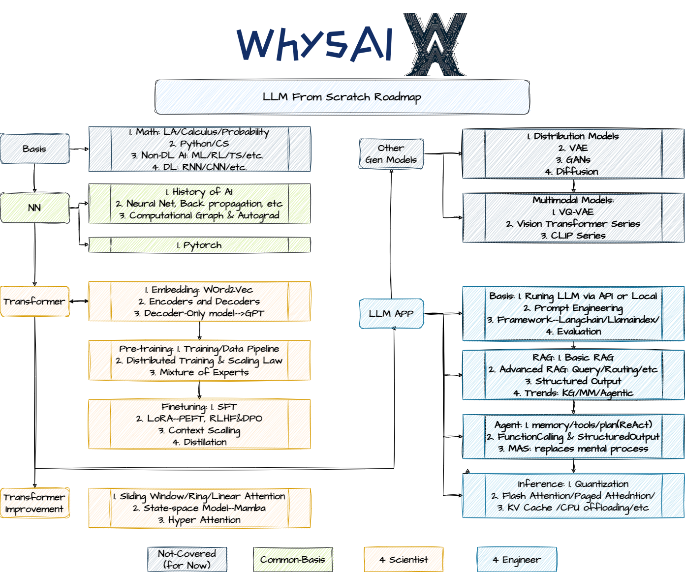

### Description

WhysAI--**LLMFS**项目是由一系列mini-projects组成、围绕大模型主题的系列课程。主要包括三个系列：1）CB：深度学习基础，包括神经网络、反向传播、PyTorch等；2）4S：以从零到一训练/微调大语言模型为核心；3）4E：以LLM应用为核心，涵盖RAG、Agent、MAS、Inference等。

本项目受到许多优秀的开源课程与资料启发，制作的课程资料包括Slides、Code、Video等，既用来记录学习现代人工智能技术的过程，又希望与大家共同探索AI技术的最佳学习路径。

### 课程内容（持续更新中）

| Series                               | Theme & Contents                                                                                       | Course Code & Materials                                                                               | Videos                                                                                                                                                                                                                                                                                                                                                                                | References                                                                                                                                                                                                                                                                                                                                                                                                                                                                                                                                                                                                                                                                                                                                                                                                                                                                                                                                                                                                                                                                                                                                                                                                                                                                   |
| ------------------------------------ | ------------------------------------------------------------------------------------------------------ | ----------------------------------------------------------------------------------------------------- | ------------------------------------------------------------------------------------------------------------------------------------------------------------------------------------------------------------------------------------------------------------------------------------------------------------------------------------------------------------------------------------- | ---------------------------------------------------------------------------------------------------------------------------------------------------------------------------------------------------------------------------------------------------------------------------------------------------------------------------------------------------------------------------------------------------------------------------------------------------------------------------------------------------------------------------------------------------------------------------------------------------------------------------------------------------------------------------------------------------------------------------------------------------------------------------------------------------------------------------------------------------------------------------------------------------------------------------------------------------------------------------------------------------------------------------------------------------------------------------------------------------------------------------------------------------------------------------------------------------------------------------------------------------------------------------- |
| A. [Common Basis](01CB-V1/readme.md) | 1. A Brief History: CB01介绍人工智能简要历史与发展历程，包括起源、达特茅斯会议、三大主义，以及机器学习、深度学习和现代人工智能                            | [CB01](https://github.com/LloydS827/WhysAI-LLMFS/tree/main/01CB-V1/01AI)                              | [bilibili](https://www.bilibili.com/video/BV1Hz3xeaEa6/?spm_id_from=333.337.search-card.all.click&vd_source=11cbe4e223f3ef3e00cac82a0cb79098),[youtube](https://www.youtube.com/watch?v=wfMV2kWjElg&t=1s)                                                                                                                                                                             | 1. [The Bitter Lesson](http://www.incompleteideas.net/IncIdeas/BitterLesson.html)by Rich Sutton 2. [智慧的疆界 (豆瓣) (douban.com)](https://book.douban.com/subject/30379536/) 3. [人工智能（第4版） (豆瓣) (douban.com)](https://book.douban.com/subject/36152133/) 4. [我看见的世界 (豆瓣) (douban.com)](https://book.douban.com/subject/36672955/)                                                                                                                                                                                                                                                                                                                                                                                                                                                                                                                                                                                                                                                                                                                                                                                                                                                                                                                                        |
|                                      | 2.1 NN 0-1：CB02-1以三次抽象为核心，从理论上介绍神经网络、梯度下降与反向传播，从而帮助理解现代人工智能技术的核心。                                      | [CB02-1](https://github.com/LloydS827/WhysAI-LLMFS/tree/main/01CB-V1/02-1%20NN%26BP)                  | [bilibili](https://www.bilibili.com/video/BV1n3hhedEgE/?spm_id_from=333.337.search-card.all.click&vd_source=11cbe4e223f3ef3e00cac82a0cb79098),[youtube](https://www.youtube.com/watch?v=6gDrrDTGLzA&t=1s)                                                                                                                                                                             | **Main Refs:** 1. Michael A. Nielsen, '[Neural networks and deep learning](http://neuralnetworksanddeeplearning.com/chap1.html)', [Github Repo](https://github.com/mnielsen/neural-networks-and-deep-learning/tree/master) 2.  The first 3/4 videos in 3B1B’s [“Neural networks”](https://space.bilibili.com/88461692/channel/seriesdetail?sid=1528929)) series. 3. Video Lecture on [MicroGrad](https://www.bilibili.com/video/BV1aB4y13761/?spm_id_from=333.337.search-card.all.click&vd_source=11cbe4e223f3ef3e00cac82a0cb79098) By Andrej Karpathy 4. [Computational Graph on BP](https://colah.github.io/posts/2015-08-Backprop/) from Chris Olah  **Others:**  1. Chapters 3-5 of the [d2l.ai](http://d2l.ai/)  2. [Neural Networks from Scratch in Python Book (nnfs.io)](https://nnfs.io/) 3. CS231n's [Python Numpy Tutorial (with Jupyter and Colab) (cs231n.github.io)](https://cs231n.github.io/python-numpy-tutorial/) 4. Numpy Tutorial: [Iris  Series Book 1《编程不难》](https://github.com/Visualize-ML/Book1_Python-For-Beginners): C13-C18 5. [An efficient pure-PyTorch implementation of KAN](https://github.com/Blealtan/efficient-kan/tree/master) 6. [NN SVG (alexlenail.me)](https://alexlenail.me/NN-SVG/index.html) |
|                                      | 2.2 NN w/ numpy：CB02-2基于前一课程理论内容，使用Python与Numpy，从零构建MLP，实现Mini-batch SGD优化发放与反向传播机制，进而解决Mnist手写数字识别问题。 | [CB02-2](https://github.com/LloydS827/WhysAI-LLMFS/tree/main/01CB-V1/02-2%20NN%26BP%20Implementation) | [bilibili](https://www.bilibili.com/video/BV1cZbpeeEi3/?spm_id_from=333.337.search-card.all.click&vd_source=11cbe4e223f3ef3e00cac82a0cb79098),[youtube](https://www.youtube.com/watch?v=Tx2akzADo-A)                                                                                                                                                                                  | 1. Michael A. Nielsen, '[Neural networks and deep learning](http://neuralnetworksanddeeplearning.com/chap1.html)', [Github Repo](https://github.com/mnielsen/neural-networks-and-deep-learning/tree/master)                                                                                                                                                                                                                                                                                                                                                                                                                                                                                                                                                                                                                                                                                                                                                                                                                                                                                                                                                                                                                                                                  |
|                                      | 2.3 Autograd：CB02-3针对反向传播算法中的核心问题（计算图与微分），使用纯Python构建小型自动微分引擎，帮助理解反向传播原理与深度学习架构核心                      | [CB02-3](https://github.com/LloydS827/WhysAI-LLMFS/tree/main/01CB-V1/02-3%20Autograd)                 | Part A: [bilibili](https://www.bilibili.com/video/BV1gs8FeQEm1/?spm_id_from=333.337.search-card.all.click),[youtube](https://www.youtube.com/watch?v=wKwOvGzswws)  Part B: [bilibili](https://www.bilibili.com/video/BV1NpezecE5p/?spm_id_from=333.337.search-card.all.click&vd_source=11cbe4e223f3ef3e00cac82a0cb79098),[youtube](https://www.youtube.com/watch?v=8oJCPYua5qU) | 1. [Andrej Karpathy \| micrograd](https://www.bilibili.com/video/BV1aB4y13761/?spm_id_from=333.337.search-card.all.click)                                                                                                                                                                                                                                                                                                                                                                                                                                                                                                                                                                                                                                                                                                                                                                                                                                                                                                                                                                                                                                                                                                                                                    |
|                                      | 2.4 Pytorch：CB02-4介绍Pytorch核心组件与典型使用方法，快速上手Pytorch、理解核心特征与功能。最后使用Pytorch复现Mnist案例(CB02-2)              | [CB02-4](https://github.com/LloydS827/WhysAI-LLMFS/tree/main/01CB-V1/02-4%20Pytorch)                  |                                                                                                                                                                                                                                                                                                                                                                                       | 1. PyTorch Official Tutorial: [Introduction to PyTorch](https://pytorch.org/tutorials/beginner/introyt.html) 2. Appendix A of [LLMs-from-scratch](https://github.com/rasbt/LLMs-from-scratch) 3. [Learn the Basics — PyTorch Tutorials](https://pytorch.org/tutorials/beginner/basics/intro.html) 4.[What is torch.nn really? — PyTorch Tutorials](https://pytorch.org/tutorials/beginner/nn_tutorial.html#closing-thoughts) 5.[cs230-stanford: Code examples in pyTorch and Tensorflow ](https://github.com/cs230-stanford/cs230-code-examples)                                                                                                                                                                                                                                                                                                                                                                                                                                                                                                                                                                                                                                                                                                                 |
|                                      | 3. A Career In AI                                                                                      | [CB03](https://github.com/LloydS827/WhysAI-LLMFS/tree/main/01CB-V1/03%20A%20Career%20In%20AI)         |                                                                                                                                                                                                                                                                                                                                                                                       | 1. [How to Build Your Career in AI eBook - Andrew Ng Collected Insights (deeplearning.ai)](https://info.deeplearning.ai/how-to-build-a-career-in-ai-book) 2. Musk's Five Steps 3. [Karpathy's Speech at Berkeley](https://www.bilibili.com/video/BV1CT421r7oL/?spm_id_from=333.337.search-card.all.click) 4. The "WRB" book:[- WRB (whereresearchbegins.com)](https://whereresearchbegins.com/) 5. "How Big Things Get Done"[怎样做成大事 (豆瓣) (douban.com)](https://book.douban.com/subject/36827775/) 6. [为什么伟大不能被计划](https://book.douban.com/subject/36357804/) [(](https://book.douban.com/subject/36357804/)[豆瓣](https://book.douban.com/subject/36357804/)[) (douban.com)](https://book.douban.com/subject/36357804/)                                                                                                                                                                                                                                                                                                                                                                                                                                                                                                                                         |
| B. 4 Scientist                       | 0. Transformer                                                                                         |                                                                                                       |                                                                                                                                                                                                                                                                                                                                                                                       | - [The Illustrated Transformer](https://jalammar.github.io/illustrated-transformer/) by Jay Alammar: A visual and intuitive explanation of the Transformer model. - [The Illustrated GPT-2](https://jalammar.github.io/illustrated-gpt2/) by Jay Alammar: Even more important than the previous article, it is focused on the GPT architecture, which is very similar to Llama's. - [Visual intro to Transformers](https://www.youtube.com/watch?v=wjZofJX0v4M&t=187s) by 3Blue1Brown: Simple easy to understand visual intro to Transformers - [LLM Visualization](https://bbycroft.net/llm) by Brendan Bycroft: Incredible 3D visualization of what happens inside of an LLM. - [nanoGPT](https://www.youtube.com/watch?v=kCc8FmEb1nY) by Andrej Karpathy: A 2h-long YouTube video to reimplement GPT from scratch (for programmers). - [Attention? Attention!](https://lilianweng.github.io/posts/2018-06-24-attention/) by Lilian Weng: Introduce the need for attention in a more formal way. - [Decoding Strategies in LLMs](https://mlabonne.github.io/blog/posts/2023-06-07-Decoding_strategies.html): Provide code and a visual introduction to the different decoding strategies to generate text.                                            |
|                                      | 1. PT                                                                                                  |                                                                                                       |                                                                                                                                                                                                                                                                                                                                                                                       | 1. [Embedding Models: From Architecture to Implementation - DeepLearning.AI](https://www.deeplearning.ai/short-courses/embedding-models-from-architecture-to-implementation/) 2.[Pretraining LLMs - DeepLearning.AI](https://www.deeplearning.ai/short-courses/pretraining-llms/) 3.  [LLMs-from-scratch](https://github.com/rasbt/LLMs-from-scratch) 4. [Let's reproduce GPT-2 (124M) - YouTube](https://www.youtube.com/watch?v=l8pRSuU81PU) 5.[Let's build GPT: from scratch, in code, spelled out. - YouTube](https://www.youtube.com/watch?v=kCc8FmEb1nY&list=PLAqhIrjkxbuWI23v9cThsA9GvCAUhRvKZ&index=7)6. [Let's build the GPT Tokenizer - YouTube](https://www.youtube.com/watch?v=zduSFxRajkE&list=PLAqhIrjkxbuWI23v9cThsA9GvCAUhRvKZ&index=9)                                                                                                                                                                                                                                                                                                                                                                                                                                                                                                          |
|                                      | 2. FT                                                                                                  |                                                                                                       |                                                                                                                                                                                                                                                                                                                                                                                       | 1. [Federated Learning - DeepLearning.AI](https://www.deeplearning.ai/short-courses/intro-to-federated-learning/) 2. [Finetuning Large Language Models - DeepLearning.AI](https://www.deeplearning.ai/short-courses/finetuning-large-language-models/)                                                                                                                                                                                                                                                                                                                                                                                                                                                                                                                                                                                                                                                                                                                                                                                                                                                                                                                                                                                                                 |
|                                      | 3. Transformer Improvement                                                                             |                                                                                                       |                                                                                                                                                                                                                                                                                                                                                                                       |                                                                                                                                                                                                                                                                                                                                                                                                                                                                                                                                                                                                                                                                                                                                                                                                                                                                                                                                                                                                                                                                                                                                                                                                                                                                              |
|                                      |                                                                                                        |                                                                                                       |                                                                                                                                                                                                                                                                                                                                                                                       |                                                                                                                                                                                                                                                                                                                                                                                                                                                                                                                                                                                                                                                                                                                                                                                                                                                                                                                                                                                                                                                                                                                                                                                                                                                                              |
| C. 4 Engineer                        | 1. Basis                                                                                               |                                                                                                       |                                                                                                                                                                                                                                                                                                                                                                                       | 1. [datawhalechina/llm-cookbook: 面向开发者的 LLM 入门教程，吴恩达大模型系列课程中文版 (github.com)](https://github.com/datawhalechina/llm-cookbook) 2. [LangChain Master Class For Beginners 2024 [+20 Examples, LangChain V0.2] - YouTube](https://www.youtube.com/watch?v=yF9kGESAi3M&t=72s) 3. [LangChain 101 Course (updated 2024 with LCEL). LangChain 101 course sessions. All code… \| by Ivan Reznikov \| Medium \| Medium](https://medium.com/@ivanreznikov/langchain-101-course-updated-668f7b41d6cb) 4. [Tutorials \| 🦜️🔗 LangChain](https://python.langchain.com/v0.2/docs/tutorials/) 5. [Conceptual guide \| 🦜️🔗 LangChain](https://python.langchain.com/v0.2/docs/concepts/) 6. [langchain源码剖析系列课程_哔哩哔哩_bilibili](https://www.bilibili.com/video/BV1fF41197XT/?spm_id_from=333.999.0.0&vd_source=11cbe4e223f3ef3e00cac82a0cb79098) 7. https://gitee.com/acedar/langchain-anal.git 8.[(85 封私信 / 80 条消息) aC大 - 知乎 (zhihu.com)](https://www.zhihu.com/people/luo-xie-piao-meng/posts?page=2)                                                                                                                                                                                                                                                                   |
|                                      | 2. RAG                                                                                                 |                                                                                                       |                                                                                                                                                                                                                                                                                                                                                                                       |                                                                                                                                                                                                                                                                                                                                                                                                                                                                                                                                                                                                                                                                                                                                                                                                                                                                                                                                                                                                                                                                                                                                                                                                                                                                              |
|                                      | 3. Agent                                                                                               |                                                                                                       |                                                                                                                                                                                                                                                                                                                                                                                       |                                                                                                                                                                                                                                                                                                                                                                                                                                                                                                                                                                                                                                                                                                                                                                                                                                                                                                                                                                                                                                                                                                                                                                                                                                                                              |
|                                      | 4. Inference Optimization                                                                              |                                                                                                       |                                                                                                                                                                                                                                                                                                                                                                                       | 1. [Introduction to On-Device AI - DeepLearning.AI](https://www.deeplearning.ai/short-courses/introduction-to-on-device-ai/)                                                                                                                                                                                                                                                                                                                                                                                                                                                                                                                                                                                                                                                                                                                                                                                                                                                                                                                                                                                                                                                                                                                                                 |
|                                      |                                                                                                        |                                                                                                       |                                                                                                                                                                                                                                                                                                                                                                                       |                                                                                                                                                                                                                                                                                                                                                                                                                                                                                                                                                                                                                                                                                                                                                                                                                                                                                                                                                                                                                                                                                                                                                                                                                                                                              |
|                                      |                                                                                                        |                                                                                                       |                                                                                                                                                                                                                                                                                                                                                                                       |                                                                                                                                                                                                                                                                                                                                                                                                                                                                                                                                                                                                                                                                                                                                                                                                                                                                                                                                                                                                                                                                                                                                                                                                                                                                              |

### Key Resources

**Key Roadmap & Resources:**

- [GenAI Handbook (genai-handbook.github.io)](https://genai-handbook.github.io/)
- [https://github.com/mlabonne/llm-course](https://github.com/mlabonne/llm-course)
- [karpathy/LLM101n: LLM101n: Let's build a Storyteller (github.com)](https://github.com/karpathy/LLM101n)

**Important：**

- Deeplearning.ai
- Andrej Karparthy: Zero 2 Hero Series
- 3B1B: NN series
- VisualizeML(Iris Series)

**Others**：

- AI Infrastructure [https://github.com/chenzomi12/AISystem/](https://github.com/chenzomi12/AISystem/)
- ML-data engineering [https://github.com/GokuMohandas/Made-With-ML](https://github.com/GokuMohandas/Made-With-ML)
- NN-deeplearning [https://zh.d2l.ai/](https://zh.d2l.ai/)
- Math & Python & ML [https://github.com/Visualize-ML](https://github.com/Visualize-ML)
- AI Papers w/ code [https://github.com/labmlai/annotated_deep_learning_paper_implementations](https://github.com/labmlai/annotated_deep_learning_paper_implementations
- Rag From Stratch by langchain: [https://github.com/langchain-ai/rag-from-scratch](https://github.com/langchain-ai/rag-from-scratch)
- Qwen Docs: [https://qwen.readthedocs.io/zh-cn/latest/index.html#](https://qwen.readthedocs.io/zh-cn/latest/index.html#)
- the bitter lesson: [https://cloud.tencent.com/developer/article/2119875](https://cloud.tencent.com/developer/article/2119875)
- [datawhalechina/llm-cookbook: 面向开发者的 LLM 入门教程，吴恩达大模型系列课程中文版 (github.com)](https://github.com/datawhalechina/llm-cookbook)
- langchain master class: [hw_dungeonrooms4q_h_en_115 (youtube.com)](https://www.youtube.com/watch?v=yF9kGESAi3M)

**Fundalmentals**

1. Python: [30 days of Python](https://github.com/Asabeneh/30-Days-Of-Python)
2. Math & Machine Learning:[Visualize-ML (Iris Series)](https://github.com/Visualize-ML)
3. Deep Learning: [D2l](https://courses.d2l.ai/zh-v2/)

### WhysAI

WhysAI由复旦大学几位在读博士发起，希望通过持续探索，来迈向卓越。Learn all we can，do the experiments，embrace the failures，then succeed。同时，欢迎关注公众号“WhysAI怀思智合”。

